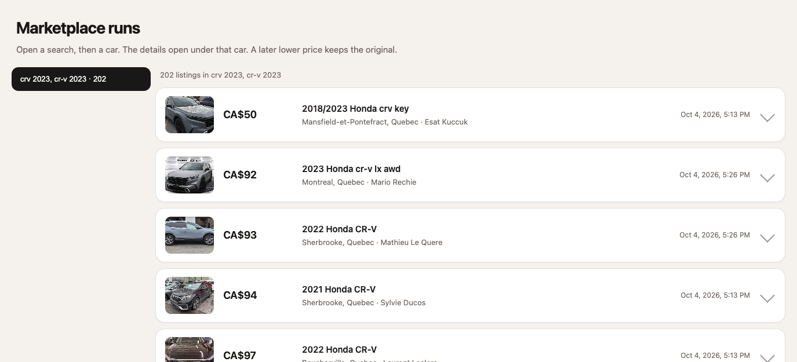
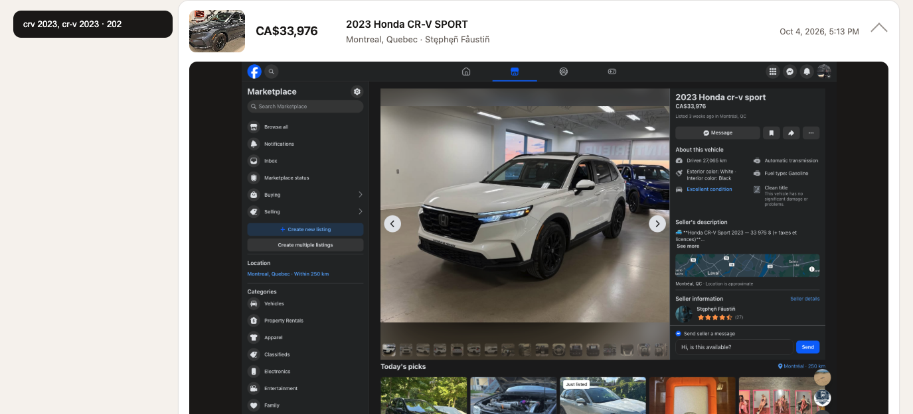

# Marketplace runs

`index.html` is the browser for saved searches. A search rewrites this file, so reload it after a run. Open it directly, or serve this folder:

```bash
python3 -m http.server 8767
```

Then open `http://127.0.0.1:8767/index.html`.

## Preview

The left side lists each search folder and how many listings it holds. Listings are cheapest first. A row shows the photo, price, title, place, seller, and the time it was last updated.



Click a row and the saved Marketplace page opens underneath that row. Click the same row again to close it. Only one row stays open.



The open row shows the page snapshot taken at search time, the listing URL, the current price, the original price, when the listing was first saved, when it last changed, and an **Open listing** link. A later lower price keeps the original price struck through and shows the new price in orange.

## What a search folder contains

Each search name is its own folder. Several names in one search share one folder, such as `crv 2023, cr-v 2023/`.

| File | Contents |
|------|----------|
| `<slug>.json` | Title, price, original price, place, seller, URL, `created_at`, `updated_at` |
| `<slug>.csv` | The same row |
| `<slug>.png` | Listing photo |
| `<slug>-page.png` | Snapshot of the listing page |
| `listings.csv` | Every listing in the folder |
